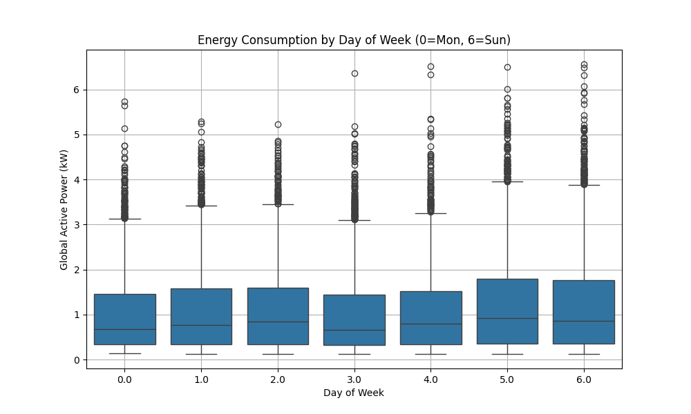

# Exploratory Data Analysis (EDA) Report

## Overview
This report analyzes the `household_power_consumption` dataset to understand the factors influencing energy usage (`Global_active_power`).

## 1. Correlation Analysis
We analyzed how strongly each feature is related to the target variable (`Global_active_power`).

### Key Findings & Explanations:
*   **Global_intensity (0.99)**: Extremely high correlation. This is expected as intensity is directly related to power (Power = Voltage x Current). It confirms data quality.
*   **Sub_metering_3 (0.70)**: Strong positive correlation. This represents the **Water Heater & AC**. These are high-load appliances, so when they run, total power spikes significantly.
*   **Sub_metering_1 (0.50)**: Moderate correlation. Represents the **Kitchen** (Dishwasher, Microwave). Cooking times lead to noticeable power increases.
*   **Sub_metering_2 (0.44)**: Moderate correlation. Represents the **Laundry Room**. Washing machines and dryers are energy-intensive but run less frequently than AC/Heaters.
*   **Voltage (-0.37)**: Negative correlation. This is an interesting electrical property; typically, as load (current) increases, voltage can drop slightly due to resistance in the lines.
*   **Hour (0.33)**: Positive correlation. Energy usage follows a daily cycle (see below).
*   **Global_reactive_power (0.31)**: Weak positive correlation. Reactive power is "wasted" power often associated with motors (fridges, pumps).

## 2. Daily Energy Profile
We averaged the energy consumption for each hour of the day.

### Observations:
*   **Morning Peak (7 AM - 9 AM)**: People waking up, using heaters, showers, and breakfast appliances.
*   **Daytime Dip**: Usage drops when people are at work/school.
*   **Evening Peak (6 PM - 9 PM)**: The highest usage period. Cooking, lighting, TV, and heating/cooling are all active.
*   **Night Low**: Minimal usage during sleep hours.

## 3. Weekly Energy Profile
We analyzed the distribution of energy usage by day of the week (0=Monday, 6=Sunday).

### Observations:
*   **Weekends (Sat/Sun)**: Generally show slightly higher median consumption and more "outliers" (high usage events) compared to weekdays. This is likely due to people being home all day, doing laundry, and cooking more.
*   **Weekdays**: Consistent patterns, likely driven by work schedules.

## 4. Conclusion for Forecasting
*   **Time Matters**: The `Hour` of the day is a critical predictor.
*   **Sub-metering is Key**: Knowing which specific appliances (AC, Kitchen) are running helps predict the total load accurately.
*   **Seasonality**: While not plotted here, the `Month` correlation (-0.04) suggests some seasonal variation (likely higher in winter/summer), though it's less dominant than the daily cycle.
